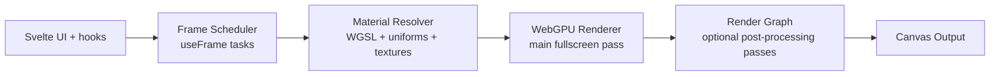

<div align="center">

# Motion GPU

**Svelte 5 + WebGPU runtime for fullscreen WGSL rendering, scheduling, and post-processing pipelines**

[](https://bun.sh)
[](https://svelte.dev)
[](https://gpuweb.github.io/gpuweb/)
[](https://www.typescriptlang.org)

</div>

## Quick Start

```bash
bun install
bun run dev
```

Main workspace commands:

```bash
bun run dev
bun run build
bun run test
bun run check
bun run lint
```

## Technical Overview

`@motion-core/motion-gpu` is designed as a strict runtime pipeline with explicit contracts.

Core building blocks:

- `FragCanvas`: owns WebGPU device/context lifecycle and frame loop.
- `defineMaterial`: validates and preprocesses WGSL (`defines` + `includes`) and resolves deterministic signatures.
- `useFrame`: registers ordered frame tasks with invalidation policies and stage orchestration.
- Render graph: executes optional post-process passes (`BlitPass`, `CopyPass`, `ShaderPass`) with source/target ping-pong.
- Diagnostics layer: normalizes WebGPU/WGSL/runtime errors into readable reports.

Rendering flow:



Runtime characteristics:

- Deterministic material/pipeline signatures to control rebuilds.
- Strict uniform/texture validation and packing rules.
- Multiple render modes: `always`, `on-demand`, `manual`.
- Built-in profiling/diagnostics snapshot API in scheduler runtime.

## Public API Surface

Root package exports:

- `FragCanvas`
- `defineMaterial`
- `useMotionGPU`
- `useFrame`
- `useTexture`
- `BlitPass`, `CopyPass`, `ShaderPass`

Advanced entrypoint (`@motion-core/motion-gpu/advanced`) additionally exports:

- `useMotionGPUUserContext`
- advanced scheduler/user-context types


## Documentation

Full package documentation is available in [`docs/`](./docs):

- architecture and concepts
- material/texture systems
- scheduler and render modes
- pass graph and render targets
- API reference
- examples and production use cases

Start here: [`docs/README.md`](./docs/README.md)
